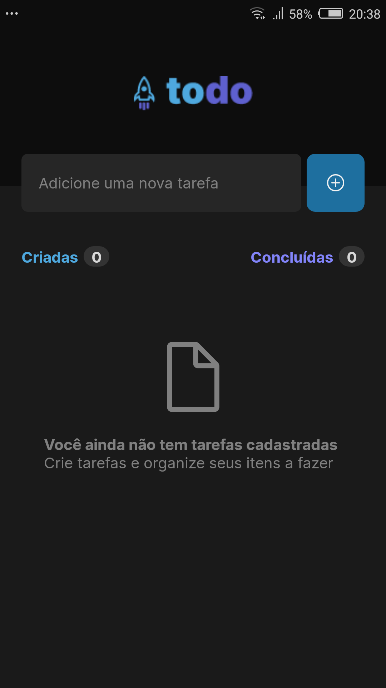
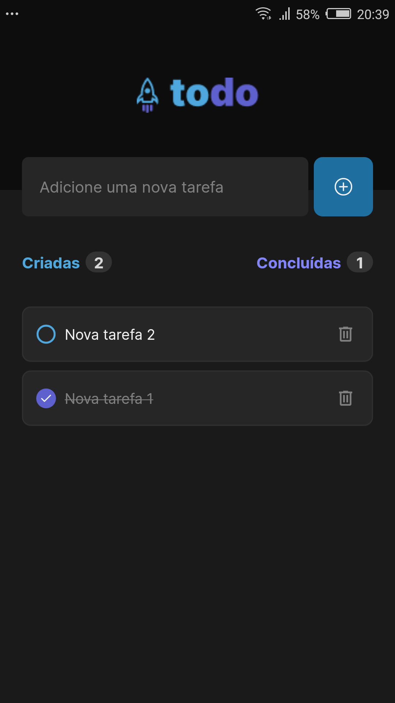
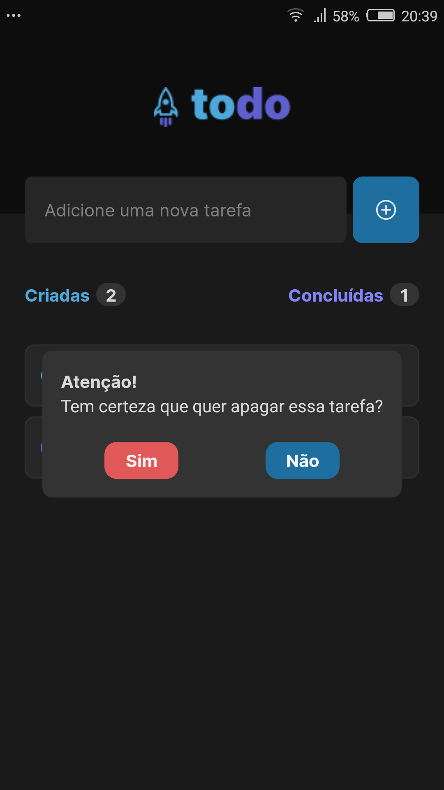
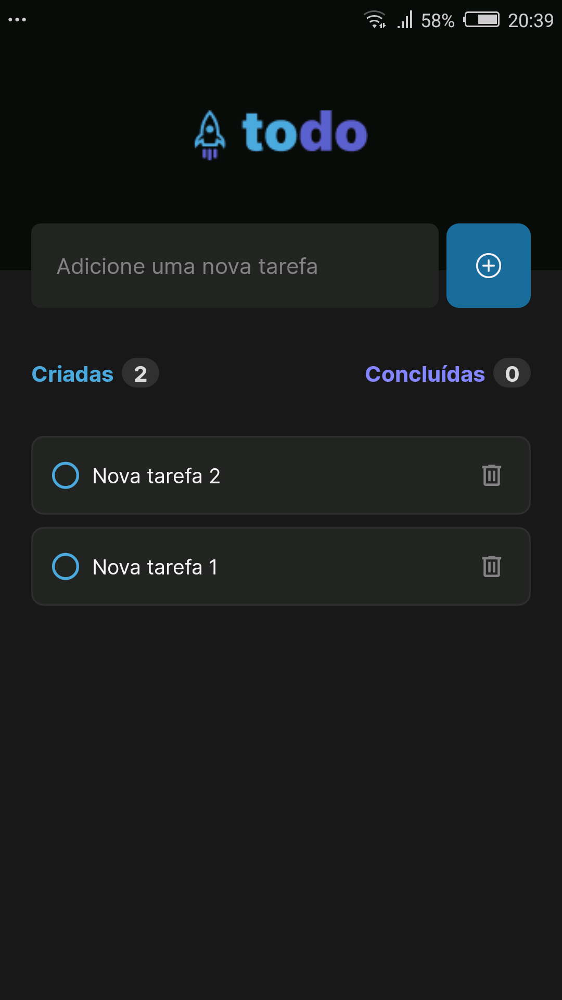
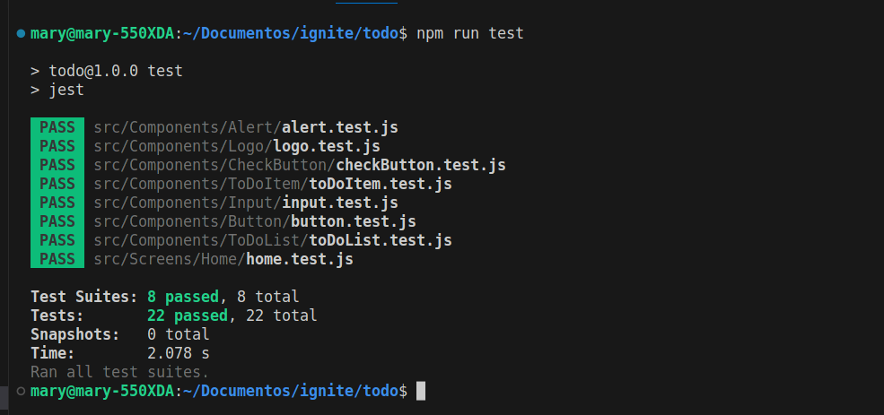

# TODO

## Descrição

  
  
  
  

Aplicação para listas de tarefas. Como desafio adicional adicionei testes em todos os níveis da aplicação: testes de unidade, testes de integração e testes end-to-end. Aplicativo desenvolvido durante o primeiro desafio do curso ignite da rocketseat. 

## Tecnologias
- [React Native](https://reactnative.dev/)
- [Expo](https://docs.expo.dev/)
- [Jest](https://jestjs.io/)
- [React Native Testing Library](https://callstack.github.io/react-native-testing-library/docs/api/#fireevent)
- [Detox](https://wix.github.io/Detox/)

## Como rodar o app
- Baixe o projeto `git clone git@github.com:MarianaBorges/ignite-todo.git`
- Instale as dependências `npm install`
- Rode o expo `npm expo start`

## Como rodar testes unitarios e testes de integração 

- Rode `npm run test`

## Como rodar testes end-to-end
- Rode o comando para construir as pastas nativas do projeto `npx expo prebuild`
- Gere um apk de teste `npx detox build --configuration android.emu.debug`
- Modifique no arquivo `.detoxrc.js` informando qual o nome do seu dispositivo de teste
- Rode o bundle pelo bare workflow `npm react-native start`
- Rode os testes no emulador `npx detox test --configuration android.emu.debug`